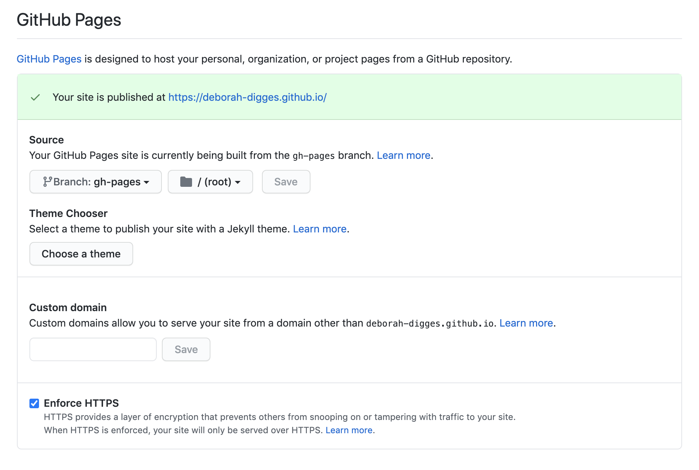

<!-- Continuously deploy your Gatsby site to GitHub pages using TravisCI -->

My [last adventure](https://deborah-digges.github.io/2020/09/16/Jekyll-to-Gatsby) was migrating my crufty Jekyll site to Gatsby. I used to deploy my Jekyll site manually by building it locally and pushing the generated static content to the `gh-pages` branch on GitHub. With my new site in place, I decided it was time to leave my old ways behind and set up an automated pipeline to deploy my site to GitHub pages.

## Why GitHub Pages?

I've always used GitHub Pages to host my blog because it's lightweight and integrates seamlessly with GitHub. It is simple, free, and provides free goodies like enforcing HTTPS by default and also supports adding a custom domain.

## Deploying Locally

Before automating the deployment of my new Gatsby site, I learned how to deploy it locally. To do this, I added an entry to the `scripts` tag in `package.json` which creates a production-ready build for my Gatsby site.

`gist:Deborah-Digges/41a4775a088c66960146c5dc10f1c232#package.json-snippet1`


```npm run build``` builds the site and places the generated assets in a folder called `public`. Copying this `public` folder to any HTTP server would deploy my site to that server.

I started an HTTP server using [http-server](https://www.npmjs.com/package/http-server) to serve the assets in the `public` folder which effectively deployed my site locally.

`gist:Deborah-Digges/41a4775a088c66960146c5dc10f1c232#run-server`

## Deploying to Github Pages

### Setting up Github Pages

I already had GitHub pages set up since I used it for my Jekyll site but I will go over the steps here for completeness.

I headed to my GitHub repository's settings page and scrolled down to the `GitHub Pages` section.


I did not want the files generated by the Gatsby build process to clutter up my `master` branch so I chose the `gh-pages` branch as the source branch for my GitHub Pages site. Any static site I pushed to this branch would then be published at `deborah-digges.github.io`. I also liked the fact that `Enforce HTTPS` was enabled by default. All the security!



### Deploying Manually

I deployed the site manually to GitHub Pages by building the site locally and pushing *only* the `public` folder to the `gh-pages` branch on GitHub.

This required a rather awkward sequence of commands.

`gist:Deborah-Digges/41a4775a088c66960146c5dc10f1c232#manual-deploy.sh`

That's a mouthful and it's easy to go and accidentally nuke your whole computer with commands like `rm -r *`. It's a good thing the [gh-pages](https://www.npmjs.com/package/gh-pages) package exists to save us from ourselves.

I added the dependency to my project to give it a spin.

`gist:Deborah-Digges/41a4775a088c66960146c5dc10f1c232#yarn-add.sh`

To let `gh-pages` know where my repository was located, I  added the `homepage` property in `package.json`.

```
{
  ...
  "homepage": "deborah-digges.github.io",
  ...
}
```

I added another script `deploy` to my `package.json` which does a `build` and then pushes the `public` folder to the `gh-pages` branch of my repository on Github.

`gist:Deborah-Digges/41a4775a088c66960146c5dc10f1c232#package.json-snippet3`


And voila! I was able to deploy my site manually from my computer using the `npm run deploy` script. My site was then up and running at [deborah-digges.github.io](http://deborah-digges.github.io/)

## ✨Continuously✨ Deploying

Great! I deployed my Gatsby site! However, I wouldn't want to be deploying a site manually from my laptop on a Friday afternoon.

I decided to [continously deploy](https://www.atlassian.com/continuous-delivery/principles/continuous-integration-vs-delivery-vs-deployment) my site so that every new commit would automatically be deployed to my GitHub Pages site. This was exciting, but I had bypassed an important step which is having automated tests for my site to ensure that a bad commit did not bring down my entire blog. However, I decided to live *dangerously* and keep the testing of my Gatsby site for a future blog post.

### Continously Deploying with Travis CI

#### Signing Up

I signed up on the [Travis CI](https://travis-ci.org/) website with my GitHub account and consented to sharing my GitHub data with Travis.

#### Enabling the Repository

I then headed to the [repositories](https://travis-ci.org/account/repositories) page and enabled builds for the `deborah-digges.github.io` repository.


#### Adding the travis.yml file

I added a `travis.yml` file to the root of my repository to tell Travis what to do on every commit to `master`.

`gist:Deborah-Digges/41a4775a088c66960146c5dc10f1c232#.travis.yml`

The `script` tag runs the `yarn run deploy` step that I previously used to deploy our site locally. It is doing some additional configuration to give the Travis CI the right access to push to my GitHub repository.

It tells the `git` client installed on Travis CI who I am.

`gist:Deborah-Digges/41a4775a088c66960146c5dc10f1c232#git-config.sh`


To provide the script push access to my GitHub repository, I embedded my [Github Token](https://docs.github.com/en/github/authenticating-to-github/creating-a-personal-access-token) environment variable in the remote URL.

`gist:Deborah-Digges/41a4775a088c66960146c5dc10f1c232#git-set-remote-url.sh`


Where did these environment variables come from?

#### Configuring Travis Environment Variables

I headed to my repository settings and made the following environment variables available to my script.


It took me a few attempts to get this right, but I am proud to say that my site is now being continously deployed to GitHub Pages on every commit to the `master` branch of my repository.


This was a lot of work, and in my quest to search for a simpler solution, I will explore using a GitHub Action to continously deploy my site. Stay tuned for more dangerous living!
