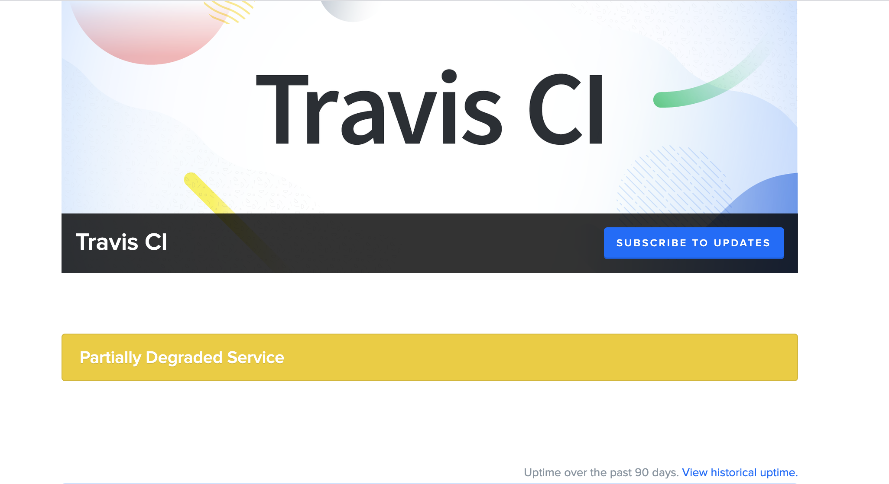
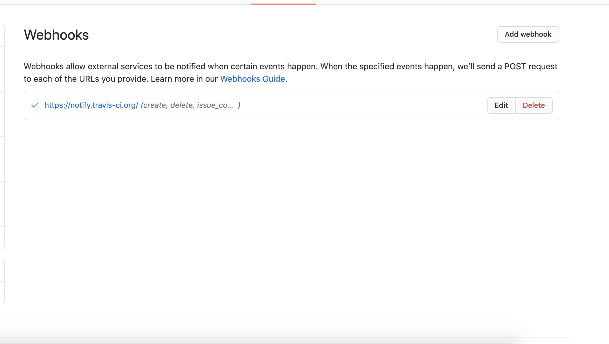
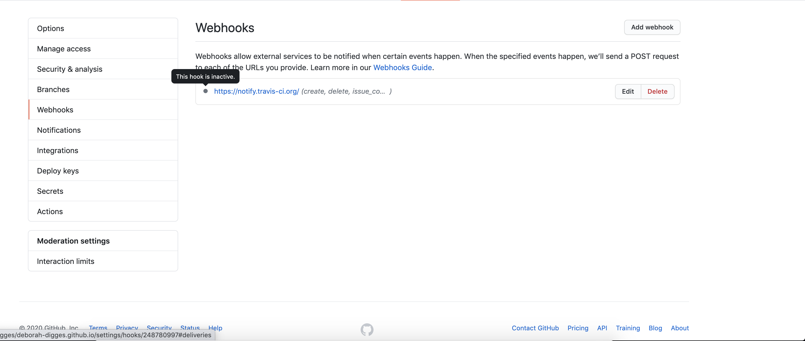
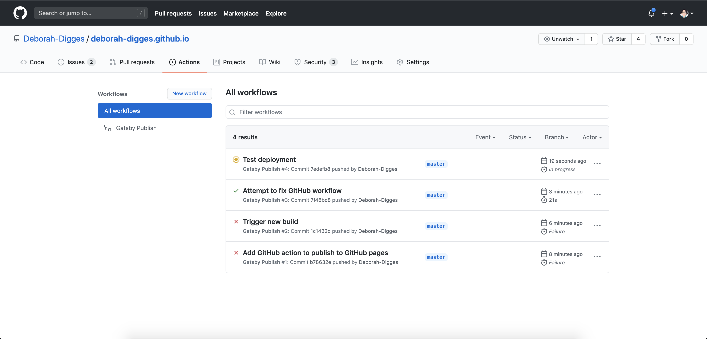

I’ve been on a fun learning journey with Gatsby over the last few weeks. So far, I’ve [migrated my old Jekyll blog to Gatsby](https://deborah-digges.github.io/2020/09/16/Jekyll-to-Gatsby), and created a pipeline that continuously deploys it to GitHub Pages. For creating the CD pipeline, I used Travis CI which I talked about at length in my [previous blog post](https://deborah-digges.github.io/2020/09/24/gatsby-deploy).

## Introducing... GitHub Actions

GitHub has been putting a lot of effort into extending its platform to support repository workflows out-of-the-box.

> GitHub Actions is your workflow: built by you, run by us.

What this means is that instead of having my builds run on an external CI server like Travis CI, the GitHub platform itself now supports these capabilities.

Actions has been in the works for a couple of years now, with the team at GitHub continuously seeking and iterating on community feedback:

- The [Limited Public Beta](https://github.blog/2018-10-16-future-of-software/) was announced in late 2018 at GitHub Universe.
- The [Public Beta](https://github.blog/2019-08-08-github-actions-now-supports-ci-cd/) was announced in August 2019 with support for CI/CD, custom events, and suggested workflows.
- GitHub Actions was made [Generally Available](https://github.blog/2019-11-13-universe-day-one/) in November 2019 at GitHub Universe.
- [Beta for GitHub Enterprise](https://enterprise.github.com/releases/2.22.0/notes) was launched in  September 2020.

## Why GitHub Actions?

I had a perfectly functioning CD pipeline running in Travis CI.

The problem? Another link in the chain that could fail, another third party tool I needed to monitor and track the status of, another line-item in my SaaS bill, another service my data flowed through and that I would need to report to my compliance team. You get it.

Funnily enough, Travis CI was reporting degraded performance when I was trying to set it up for my blog, which made me question my sanity at first since I couldn't get it to work even after a couple of tries.

GitHub Actions provides some relief from these pitfalls:

- Avoids introducing a third party tool and prevents data from flowing through another service.
- Provides a [lower pricing plan](https://docs.github.com/en/free-pro-team@latest/github/setting-up-and-managing-billing-and-payments-on-github/about-billing-for-github-actions#about-billing-for-github-actions) than a separate service for CI/CD. It is free for public repositories and pay-as-you-go for private repositories.
- Allows the **re-use** of shared workflows. This point is especially important as it prevents developers from having to solve the same problems over and over again. Instead, public workflows create an [ecosystem of Actions](https://github.com/marketplace?type=actions) that developers can fork, edit, iterate, and improve upon, much like code.

## How Does a Travis CI Build Work?

I’ve gone over how I configured my blog's GitHub repository to use Travis CI in my [previous blog post](https://deborah-digges.github.io/2020/09/24/gatsby-deploy).

When I enabled my repository for builds in the Travis CI dashboard, it set up a Webhook configuration in the repository.

This configuration causes events generated on this repository to be pushed to a Travis CI hosted webhook, that will trigger a build based on the steps defined in my `.travis.yml` file.

## Using a GitHub Action to Trigger a Travis CI Build

This approach does not do much to improve my workflow as it only changes the integration point between GitHub and Travis CI.

Instead of a Travis-hosted webhook that listens for Github events, the [Travis-CI GitHub action](https://github.com/travis-ci/actions
) uses the [Travis CI v3 api](https://github.com/travis-ci/actions/blob/master/create-build.js#L19) to trigger a build on Travis CI in response to an event on Github.

The dependency remains as do the problems related with it. People were quick to [catch on](https://github.com/travis-ci/actions/issues/3) though.

## Using a GitHub Action to Deploy My Gatsby Site (Goodbye, Travis)

To eliminate the dependency on Travis CI, I began looking for a GitHub Action that could perform the same functionality as my Travis CI build and deploy pipeline: run a build, run some tests (that don't exist yet), deploy the generated site to `gh-pages`.

It didn't prove too hard to find a community-build action for this purpose and integrate my repository with it:

- Disabled the Travis CI build in my [Travis CI settings](https://travis-ci.org/account/repositories) which disabled the corresponding Webhook in Github.

- Searched on the [GitHub Actions Marketplace](https://github.com/marketplace) for a [suitable action](https://github.com/marketplace/actions/gatsby-publish) to deploy a Gatsby site to GitHub Pages.

- Added the action to a YAML file in my repository under [.github/workflows](https://github.com/Deborah-Digges/deborah-digges.github.io/blob/master/.github/workflows/build_and_publish.yml)

`gist:Deborah-Digges/6e4f6572b7e75925ed8aa3f5411cbcc8`

- Added the environment variable `ACCESS_TOKEN` to my GitHub repository `Secrets` with a personal [GitHub token](https://github.com/settings/tokens/).

- Triggered a build by pushing a new commit to master!

## Reaping the Benefits

Even with this small project, I’ve reaped the benefits of GitHub Actions:

- My blog's build process no longer has a dependency on Travis CI. I was able to disable the repository on Travis CI and also delete my account.
- I was able to [removed the code](https://github.com/Deborah-Digges/deborah-digges.github.io/commit/d421e5570f9c2c9f68e59f2ebc3078fd65d642ba
) and knowledge about how to deploy to Github Pages within my project by reusing a shared workflow built by someone else.

I’m excited to have explored GitHub actions and what it’s capable of by re-using an existing workflow. Join me in my next blog post to explore how to write a custom workflow from scratch!

